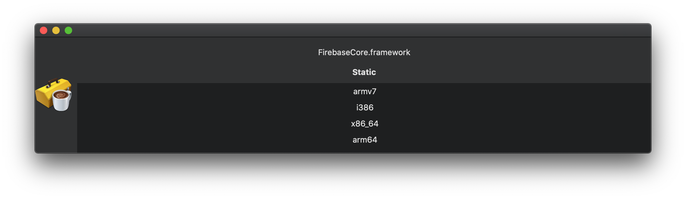

# FrameworkInspector

Mac app written in SwiftUI thats inspects the framework with `file` tool and presents it's type and supported architectures. 

### Usage:

Download the binary or build it with Xcode 11 and Swift 5.
When app is running just drag and drop any `.framework`.

